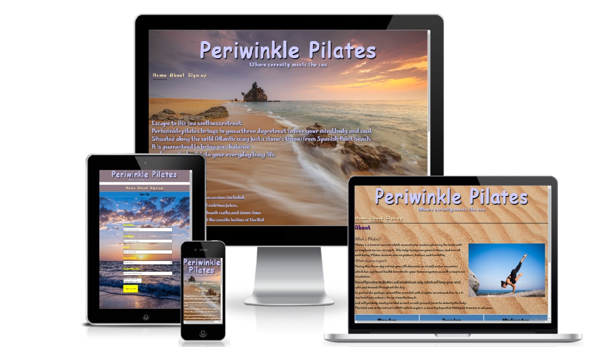

# Periwinkle Pilates
[View Website Here](https://stefka92.github.io/periwinkle-pilates/)

Periwinkle Pilates is a website created to promote a three day wellness retreat situated on the beach in Spanish Point, Co.Clare. The idea for the website arose from a local retreat in this area. The website will  outline the benefits of Pilates and taking time to switch off from everyday life in general and what better way to do so other than a Mini seascape.Looking after our health is vital in this day and age and practicing meditation and mindfulness is very important for our overall mental health.
> It has also been proven that Spending time by the sea has been shown to help us feel happier, healthier, calmer and more creative.

This website will be targeted towards any one feeling the added stress of life in general and are looking for a mini escape to recharge their batteries. This website was created for educational purposes only.

The Website is made up of 4 Pages;
- Home. Which gives a brief description of the retreat and what we offer.
- About. Which explains what the retreat consists of and also a detailed daily schedule.
- Sign-up. This page contains a form for users to sign-up to the retreat.
- Thank you. A brief thank you message for signing up.

The business goals for the website are;
- To provide information to the customer as to who we are.
- To explain to the customer why this retreat might suit them.
- To provide information as to where this retreat is.
- To allow customers to sign up online.
- To be able to view the website on a range of different device sizes.

The Users Goals of the website are;
- As a first time user, to be able to navigate the website easily.
- As a first time user, understand what product we have on offer without  having to read through loads of content.
- As a first time user, to allow the user to be able to contact the organizers with any queries they may have.
- As a recurring or first-time visitor, to be able to find links to our social media for more information at ease.
- As a recurring or first-time visitor to experience a straightforward process to sign up to the retreat.

## Strategy

### Considering the core UX principles.

I first had to think about who my target audience would be and what would keep it simple and straightforward for them. As mindfulness is about decluttering the mind I decided to keep the website minimal,  clutter free and straight to the point.

Periwinkle Pilates target users are:
- Aged 18 onwards
- Both Male and females
- People interested in health and wellness
- Open minded people willing to try new experiences
- People looking to slow down from everyday life and learn how to switch off both the body and mind.
- Anyone feeling tired or run down and in need of a detox.

What these users would be looking for:
- Easy to navigate website with clear straightforward information.
- Photos that reflect calmness and provide inspiration to Sign up.
- How much the Retreat costs.
- A clear list of what the three day retreat consists of.
Due to the different ranges in ages of the users, it is assumed that there will be  users viewing the site on their Laptops, tablets and mobile phones and therefore creating something responsive is an extremely important aspect in the design.

## Scope

In order to meet the above criteria, the following features will be included in the website
- A Header when clicked will take you back to the home page
- A clear Navigation menu 
- Contact Section
- Social Media links
- A number of images of the beach to bring a sense of calmness to the website
- Straight to the point information
- Sign up form

## Structure
The website is made up of four pages, three of which can be accessed from the navigation menu (Home, About & Sign-up). The fourth page is a brief thank you page which you are redirected to once you sign up for the retreat.

All Pages on the website have:

- A responsive navigation bar at the top which allows the user to navigate through the site. 
- A footer which contains social media links to instagram and facebook along with their icons. The footer also contains a contact us section with all relative information to get in touch.
- Home Page.
    - A section with a brief description of what this website is offering.
     - A Highlights Section. This section contains an unordered list with some of the main offerings of the retreat. There is also a button labeled “Find out more” which takes you to the about page.
- About Page.
     - A section that goes into more detail as to what the retreat offers and the benefits of Pilates.
     - An image of a lady in a Pilates pose is added to the right of the text to fit in with the description.
      - A Section with a table containing the 3 day schedule is added underneed the description section.
      - A sand background image was added to this page to fit in with the theme of the website.
- Sign Up Page.
      - A Form consisting of 5 input fields for the users First name, Last name, email address, date of birth, and contact number an additional box was added giving            the user the option to submit any special requests they may have.
         The user must fill in the First 5 input fields in order to submit otherwise a pop up message appears stating  **Please fill out this form**.  
            The user submits the form using the submit button which is titled **Sign up now**. 
- Thank You Page.
   - A brief thanks message to the user letting them know their form has successfully been submitted.

## Skeleton
 
Please note the actual website has changed Since these wireframes.
During the building process I decided to Change the home page and added an image as the background as I felt it stood out more as I had not much content on the home page as I did not want it cluttered. I also added a button to link to the about page if the user wanted to find out more.
I also decided to change my about page slightly and added my image opposite the text as I felt it looked better this way.

## Surface
The website uses a variety of colours that are associated with the beach. The heading is a periwinkle shade which is carried throughout the website to represent the Website name. The brown and wheat colors are to represent the sand. The grey colours are to bring out the colors of the rocks on the beach. The blue colours are to represent the water and give that blue water calming effect. The colour palette was created using the https://coolors.co/ website.

I used Google fonts “Maher” throughout the website as after trialing several different fonts I found this one stood out the most as it was clear and still ledable on smaller devices.
 
### Languages Used
HTML - Used as the basic building block for the project and to structure the content.
CSS - Used to style the web content.
Frameworks, Libraries & Programs Used
https://lucid.app/ - Used to create wireframes.
Git - For version control.
Github - To save and store the project files for the website.
Gitpod- Used to deploy the website.
Google Fonts - To import the fonts used on the website.
Font Awesome - For the icons used on the website.
Google Dev Tools - Used to test styles and fix features within the website.
Pexels.com- Used to access and download free images for the website.
Coloors- Used to create a colour palette for the design.
Am I Responsive? To view the website image on a range of different devices.
 
### Deployment
Github Pages was used to deploy the live website. The instructions to achieve this are below:
1. Log in (or sign up) to Github.
2. Find the repository for this project,Periwinkle Pilates.
3. Click on the Settings link.
4. Scroll down to Pages on the left hand side of the navigation bar and click on this link.
6. In the Source section, choose main from the drop down select branch menu. Select Root from the drop down select folder menu.
7. Click Save. Your live Github Pages site is now deployed at the URL shown (This may take a few minutes to show up).
 
## Testing
To test my website I went through the following tests:
I carried out each test using different browsers which included google chrome, firefox and microsoft.

**Links**
1. Test each link on the index page which included the Header link, the navigation links, the find out more button and both social media links which opened in separate tabs.
2. Test each link on the About page which included the Header link, the navigation links, and both social media links which opened in separate tabs.
3. Test each link on the Sign-up page which included the Header link, the navigation links, the sign up now button and both social media links which opened in separate tabs.

**Form**
1. Test the form leaving out the First name.I  tried to fill out the form leaving out the first name, when I tried to click the sign up now button. The error message appeared stating that I had to fill in the First Name
2. Test the form leaving out the Last name.I  tried to fill out the form leaving out the Last name, when I tried to click the sign up now button. The error message appeared stating that I had to fill in the Last Name.
3. Test the form leaving out the Email.I  tried to fill out the form leaving out the Email address, when I tried to click the sign up now button. The error message appeared stating that I had to fill in the Email address.
4.Test the form leaving out the Date of birth.I  tried to fill out the form leaving out the Date of Birth, when I tried to click the sign up now button. The error message appeared stating that I had to fill in the Date of Birth.
5.Test the form leaving out the contact number. I  tried to fill out the form leaving out the contact number, when I tried to click the sign up now button. The error message appeared stating that I had to fill in the Contact Number.

### Lighthouse testing
 
I used Lighthouse on google chrome to test the performance, accessibility, best practices and seo.
 
### HTML and CSS Validation
I used W3C to test both my HTML and CSS
 
 
 
 
 

